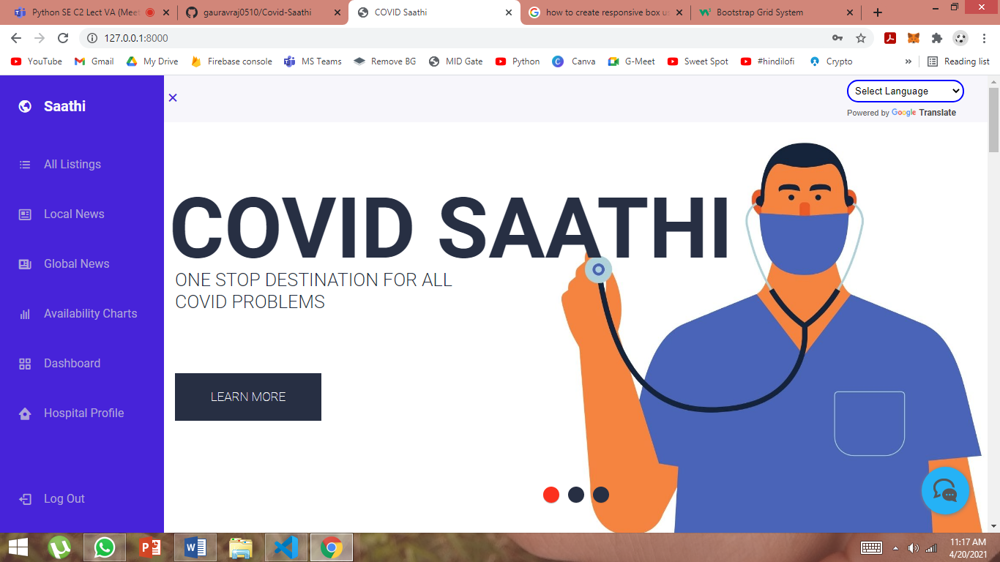
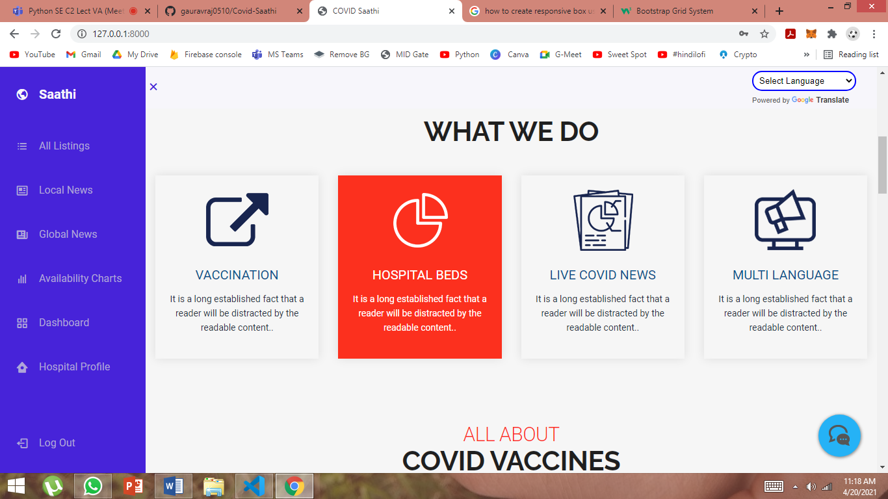
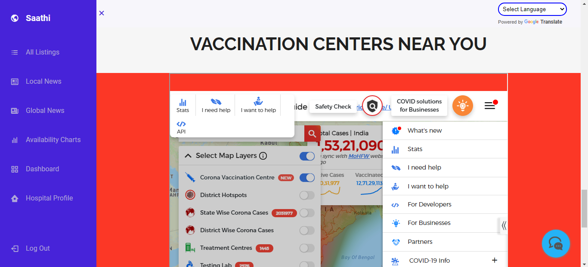
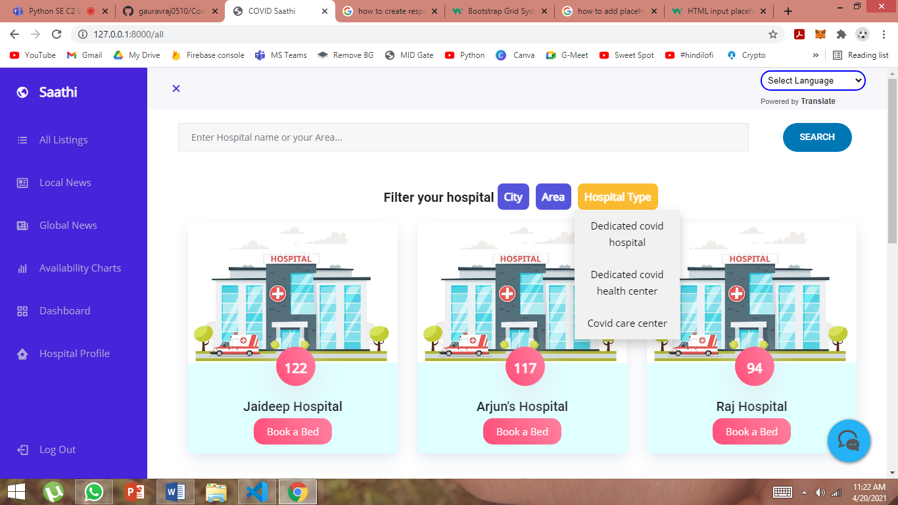
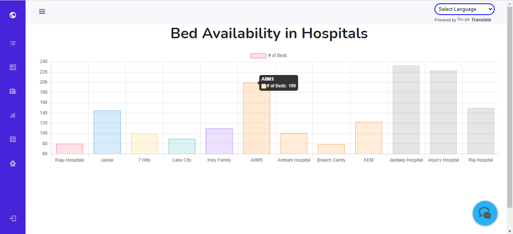
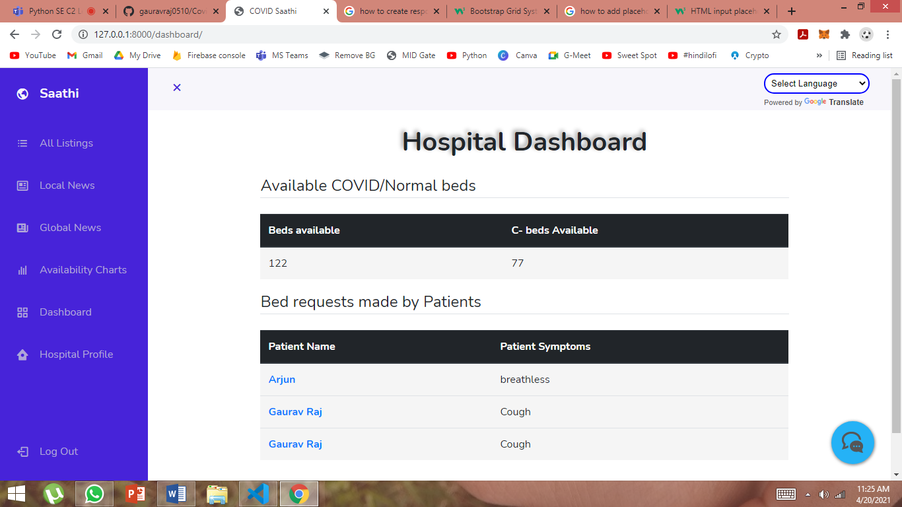
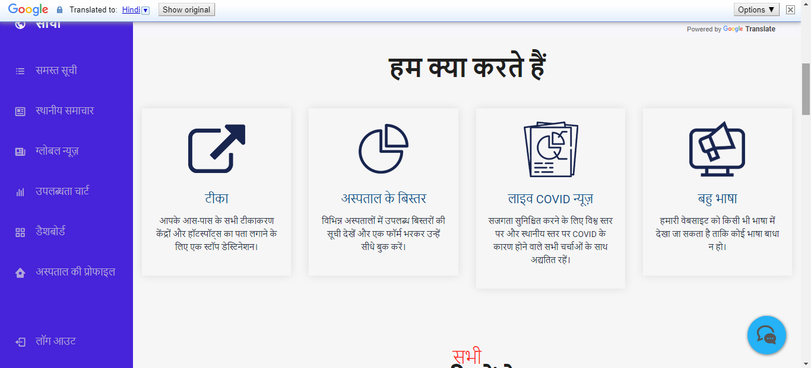
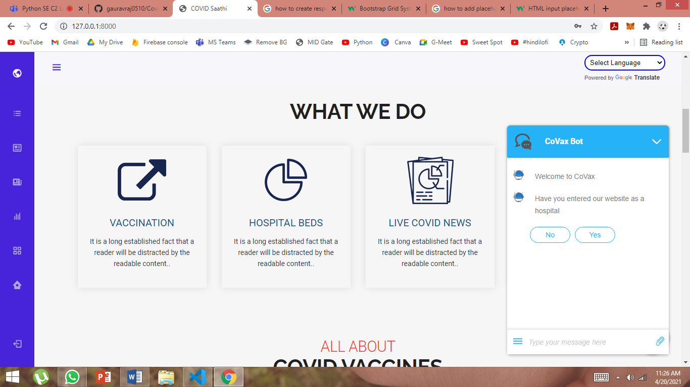
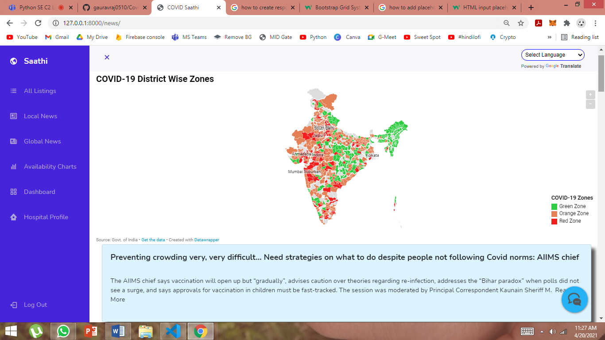
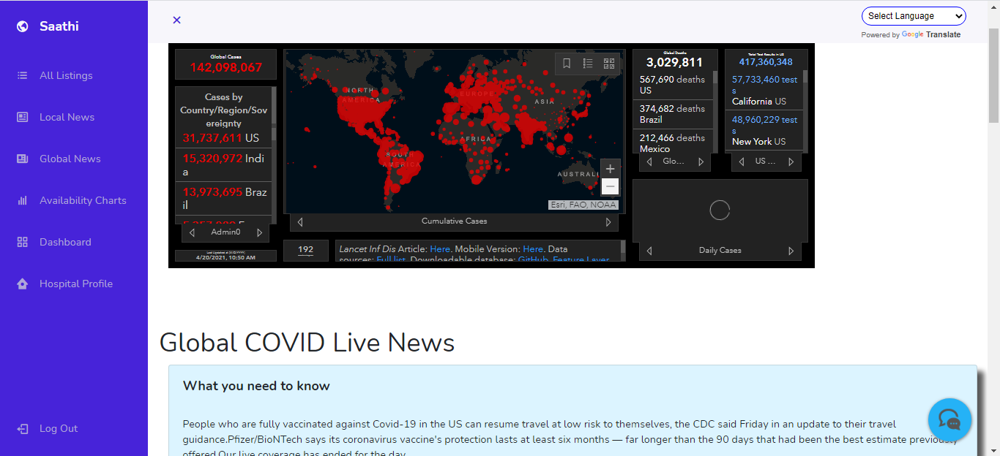

# COVID Saathi

Our platform helps patients to keep themselves updated with the no of beds available in the hospitals near them in case of emergency. And also provides them their nearest vaccination centres by just entering their current location. They can also book beds in case of emergency for COVID patients.

## Features 
 - Live Bed Availability at various hospitals
 - Book a bed if available
 - Locate nearby vaccination centers
 - Read Live COVID news both local and global news available 
 - Multi language and chat bot support 

## Home Page
 - Home page design and look 

 
 
## Main features 
- Our Services 

- Find Vaccination Centers 

- Hospitals with available number of beds

- Available beds as Chart View 

- Hospital Dashboard showing all bed requests

- Multilanguage Support 

- Chat Bot support 

- Local COVID News 

- Global COVID News 

## How to run project
 - Star and clone this repo
 - activate your virtualenv
 - run: pip install -r requirements.txt in your shell
 - run: python manage.py runserver in your shell

